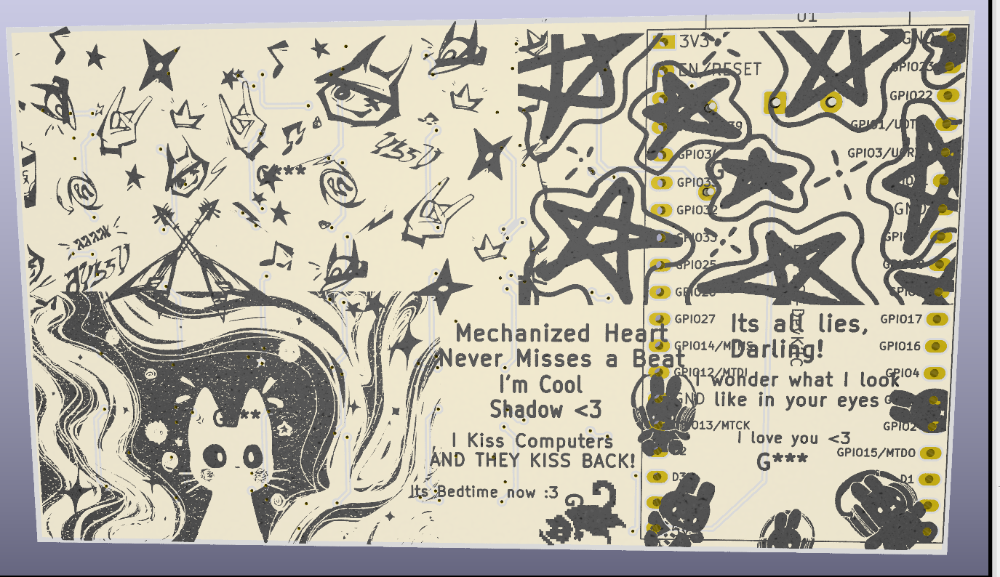
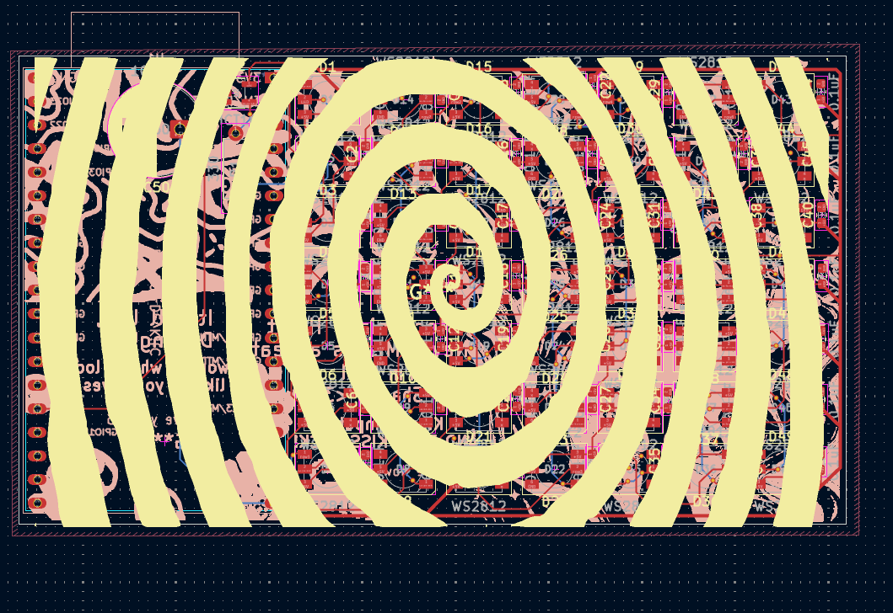
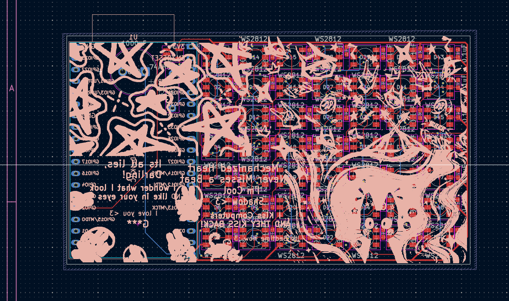

<<<<<<< HEAD
| Retro-TV |
| --- |
|  | 

Its a LED Matrix display of 7x7 LEDs, in a vintage television style case!  

### PCB
The PCB is designed to be compact with about 50 LEDs in just about 60mm of space
| LED Matrix |
| --- |
|  | 

| MCU |
| --- |
|  |

| PCB (All Layers)|
| --- |
|  |
| --- |
|  |

| PS : Some PCB art|
| --- |
|  |
| --- |
|  |
| --- |
|  |

## Case

The case is designed to be 3D printed and attached with magnets. The bottom case, top case, plate, and knob are all designed to be printed.

| CAD|
| --- |
|  |
| --- |
|  |

## BOM 
|Name                        |Purpose                                |Cost Per Item (USD)|Quantity|Total (USD)|Link                                                                                                                                                                                                                                                                                                                                                                                                                                                                                                          |Distributor     |
|----------------------------|---------------------------------------|-------------------|--------|-----------|--------------------------------------------------------------------------------------------------------------------------------------------------------------------------------------------------------------------------------------------------------------------------------------------------------------------------------------------------------------------------------------------------------------------------------------------------------------------------------------------------------------|----------------|
|3D Prints                   |to get prints from #printing-legion    |5.00               |1       |5.00       |                                                                                                                                                                                                                                                                                                                                                                                                                                                                                                              |#printing-legion|
|Soldering Hotplate          |To solder the mini leds                |0.00               |1       |0.00       |                                                                                                                                                                                                                                                                                                                                                                                                                                                                                                              |Self sourced    |
|Soldering paste             |to solder the smd components           |4.50               |1       |4.50       |https://www.amazon.in/gp/product/B0F9VTZJ5R?smid=A32I52VHFPY5IG&psc=1                                                                                                                                                                                                                                                                                                                                                                                                                                         |Amazon          |
|Alkin 65W adapter           |To use the soldering hotplate to solder|8.54               |1       |8.54       |https://www.amazon.in/AILKIN-Charging-Adapter-Multi-Port-Compatible/dp/B0GH81K2LK?crid=WF9QX765130Z&dib=eyJ2IjoiMSJ9.y109kyXIda8EdsX6DmyLc7Ct8sLh5g0dF3BTo2-PFvVzBm2er4SxHfDKU4Hr5NPA8yfTA9wzzGvEpIZqqoM65C-fW6aWJySmadJsd-KR7G0xMvxDkAgR5lkbsAFU4BAfi4bngmddfTHXbUTOggHFI3yQklGQg8kKB2kZIpbg_5mR9pZSpv4IxL0D5Nh6j2RvENrpHNuMKFqMFQ7vNoEfNMVAlhyqgAgMS-CQnSgDd_U.ipAeLdsmErAF3HJuhAX2E9gJ9zC4Vg1IA7Hfn_dZjtw&dib_tag=se&keywords=pd%2B65w%2Badapter&qid=1774040169&sprefix=pd%2B65w%2B%2Caps%2C375&sr=8-4&th=1|Amazon          |
|Neodimium magnets           |to attach the top and bottom case      |3.00               |1       |3.00       |https://www.amazon.in/gp/product/B0G2SW9GZL?smid=AP7MBNLZTN3FQ&psc=1                                                                                                                                                                                                                                                                                                                                                                                                                                          |amazon          |
|330 ohm resistor ( 10 moq ) |to not burst the leds                  |0.11               |1       |0.11       |https://robu.in/product/330-ohm-1w-metal-film-resistor-pack-of-40/                                                                                                                                                                                                                                                                                                                                                                                                                                            |robu.in         |
|1000uF capacitor            |Bulk capacitor                         |0.11               |1       |0.11       |https://robu.in/product/1000uf-25v-electrolytic-capacitor-dip-pack-of-5/                                                                                                                                                                                                                                                                                                                                                                                                                                      |robu.in         |
|0.1uF capacitors            |to reduce electrical noise             |0.07               |50      |3.75       |https://probots.co.in/0-1-uf-50v-smd-ceramic-capacitor-0603-package.html                                                                                                                                                                                                                                                                                                                                                                                                                                      |probots.co      |
|74AHCT1G125GV               |Level shifter for LEDs                 |0.16               |1       |0.16       |https://robu.in/product/74ahct1g125gv125-nexperia-1-8ma-4-5v5-5v-8ma-1-sot-753-buffers-drivers-receivers-transceivers-rohs/                                                                                                                                                                                                                                                                                                                                                                                   |robu,in         |
|SMD 5050 LEDs               |For the display                        |0.04               |50      |2.00       |https://www.flyrobo.in/5050-red-green-blue-rgb-smd-led                                                                                                                                                                                                                                                                                                                                                                                                                                                        |flyrobo.in      |
|ESP32 Devboard              |MCU to control the LEDs                |4.62               |1       |4.62       |https://www.flyrobo.in/esp-wroom-32-nodemcu-module?search=esp32&description=true                                                                                                                                                                                                                                                                                                                                                                                                                              |flyrobo.in      |
|PCB ( 5 MOQ )               |to solder all the components           |13.02              |1       |13.02      |                                                                                                                                                                                                                                                                                                                                                                                                                                                                                                              |JLCPCB          |
=======
| Retro-TV |
| --- |
|  | 

Its a LED Matrix display of 7x7 LEDs, in a vintage television style case!  

### PCB
The PCB is designed to be compact with about 50 LEDs in just about 60mm of space
| LED Matrix |
| --- |
|  | 

| MCU |
| --- |
|  |

| PCB (All Layers)|
| --- |
|  |
| --- |
|  |

| PS : Some PCB art|
| --- |
|  |
| --- |
|  |
| --- |
|  |

## Case

The case is designed to be 3D printed and attached with magnets. The bottom case, top case, plate, and knob are all designed to be printed.

| CAD|
| --- |
|  |
| --- |
|  |

## BOM 
|Name                        |Purpose                                |Cost Per Item (USD)|Quantity|Total (USD)|Link                                                                                                                                                                                                                                                                                                                                                                                                                                                                                                          |Distributor     |
|----------------------------|---------------------------------------|-------------------|--------|-----------|--------------------------------------------------------------------------------------------------------------------------------------------------------------------------------------------------------------------------------------------------------------------------------------------------------------------------------------------------------------------------------------------------------------------------------------------------------------------------------------------------------------|----------------|
|3D Prints                   |to get prints from #printing-legion    |5.00               |1       |5.00       |                                                                                                                                                                                                                                                                                                                                                                                                                                                                                                              |#printing-legion|
|Soldering Hotplate          |To solder the mini leds                |0.00               |1       |0.00       |                                                                                                                                                                                                                                                                                                                                                                                                                                                                                                              |Self sourced    |
|Soldering paste             |to solder the smd components           |4.50               |1       |4.50       |https://www.amazon.in/gp/product/B0F9VTZJ5R?smid=A32I52VHFPY5IG&psc=1                                                                                                                                                                                                                                                                                                                                                                                                                                         |Amazon          |
|Alkin 65W adapter           |To use the soldering hotplate to solder|8.54               |1       |8.54       |https://www.amazon.in/AILKIN-Charging-Adapter-Multi-Port-Compatible/dp/B0GH81K2LK?crid=WF9QX765130Z&dib=eyJ2IjoiMSJ9.y109kyXIda8EdsX6DmyLc7Ct8sLh5g0dF3BTo2-PFvVzBm2er4SxHfDKU4Hr5NPA8yfTA9wzzGvEpIZqqoM65C-fW6aWJySmadJsd-KR7G0xMvxDkAgR5lkbsAFU4BAfi4bngmddfTHXbUTOggHFI3yQklGQg8kKB2kZIpbg_5mR9pZSpv4IxL0D5Nh6j2RvENrpHNuMKFqMFQ7vNoEfNMVAlhyqgAgMS-CQnSgDd_U.ipAeLdsmErAF3HJuhAX2E9gJ9zC4Vg1IA7Hfn_dZjtw&dib_tag=se&keywords=pd%2B65w%2Badapter&qid=1774040169&sprefix=pd%2B65w%2B%2Caps%2C375&sr=8-4&th=1|Amazon          |
|Neodimium magnets           |to attach the top and bottom case      |3.00               |1       |3.00       |https://www.amazon.in/gp/product/B0G2SW9GZL?smid=AP7MBNLZTN3FQ&psc=1                                                                                                                                                                                                                                                                                                                                                                                                                                          |amazon          |
|330 ohm resistor ( 10 moq ) |to not burst the leds                  |0.11               |1       |0.11       |https://robu.in/product/330-ohm-1w-metal-film-resistor-pack-of-40/                                                                                                                                                                                                                                                                                                                                                                                                                                            |robu.in         |
|1000uF capacitor            |Bulk capacitor                         |0.11               |1       |0.11       |https://robu.in/product/1000uf-25v-electrolytic-capacitor-dip-pack-of-5/                                                                                                                                                                                                                                                                                                                                                                                                                                      |robu.in         |
|0.1uF capacitors            |to reduce electrical noise             |0.07               |50      |3.75       |https://probots.co.in/0-1-uf-50v-smd-ceramic-capacitor-0603-package.html                                                                                                                                                                                                                                                                                                                                                                                                                                      |probots.co      |
|74AHCT1G125GV               |Level shifter for LEDs                 |0.16               |1       |0.16       |https://robu.in/product/74ahct1g125gv125-nexperia-1-8ma-4-5v5-5v-8ma-1-sot-753-buffers-drivers-receivers-transceivers-rohs/                                                                                                                                                                                                                                                                                                                                                                                   |robu,in         |
|SMD 5050 LEDs               |For the display                        |0.04               |50      |2.00       |https://www.flyrobo.in/5050-red-green-blue-rgb-smd-led                                                                                                                                                                                                                                                                                                                                                                                                                                                        |flyrobo.in      |
|ESP32 Devboard              |MCU to control the LEDs                |4.62               |1       |4.62       |https://www.flyrobo.in/esp-wroom-32-nodemcu-module?search=esp32&description=true                                                                                                                                                                                                                                                                                                                                                                                                                              |flyrobo.in      |
|PCB ( 5 MOQ )               |to solder all the components           |13.02              |1       |13.02      |                                                                                                                                                                                                                                                                                                                                                                                                                                                                                                              |JLCPCB          |
>>>>>>> c8a452447a518745ea2085dd8981138584917547
